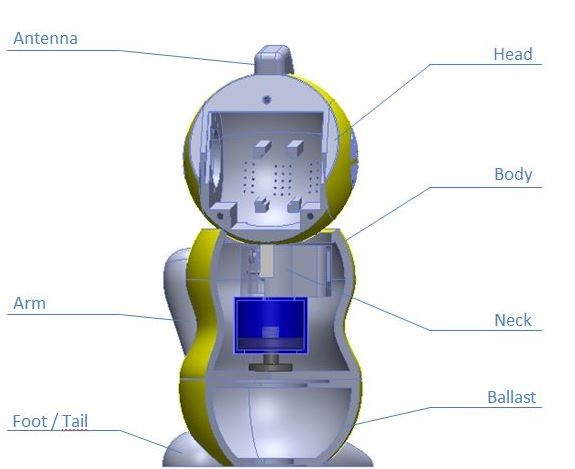

# README

## Abstract
Jules is a project started in February 2015. The aim of this project is to design a robot to help elementary and kindergaten teachers in there everyday jobs. 

Jules is designed to be safe for kids, nice looking and usefull for their teachers. Jules must be suitable to kids from 5 to 9 years old and propose differents scenarios for them too.

## Folders Structure

The Models folder contains all SolidWorks models (created with SolidWorks 2013). The Printing models are STL files designed to be printed with 3D printers.

* README
* models
    * accessories 
        * arms
        * feet
            * first_edition
            * second_edition
        * tail  
    * body   
        * neck
        * ballast
    * electronics   
        * ballBearing1
        * dynamixels
    * head  
        * antenna
* printing
    * antenna  
    * arms  
    * body  
    * feet  
    * head  
    * neck
    * ballast
    * tail

## Components

The components listed here are components we designed our solution for. 
Not all the components are required to create a first version of the robot.

#### Head components
* Camera - [LogitechC920]
* Actuator Dynamixel RX-24f - [Dynamixel]
* Screen + TouchScreen - HDMI+VGA+2AV Controller Board VS-TY2662-V1 7 inch 800* 480  Lcd Panel AT070TN92 with Touch Screen  
    * USB Controller Card
    * USB Cable
* Speakers Monacor SPP-90 - [Speakers]
    * Audio amplifier - [Amplifier]
* Actuator to card transformer - [USB2Dynamixel]
* Electronic card + Heat sink - [BananaPi]

#### Body components
* Microphone - [Boya]
* Actuator - [Dynamixel]
* On/Off button
* Ultrasound card - HC-SR04

#### Other mendatory materials
* Ball bearing (x1) - [BallBearing1]
* Ball bearing (x2) - [BallBearing2]
* Power supply cable 12V 3A
* Power supply socket 
* Power converter (12V to 5V) - DC-DC 12V/ 24V to 5V 5A Step Down Regulator Module 25W Converter
* Power usb plug - Male B type Version 2.0 Micro USB Connector, 100 V ac, 1.8A
* SD card - 32Gb class 10
* Dynamixel cables - 4-pin
* ProtoBoard - [ProtoBoard]
* Resistor 470 ohm
* Resistor 330 ohm
* Wires
* Soldering iron
* Screws

[LogitechC920]:http://www.logitech.com/en-hk/product/hd-pro-webcam-c920
[Dynamixel]: http://en.robotis.com/index/product.php?cate_code=10101112&bbs_no=29#product_title
[Speakers]:http://www.monacor.co.uk/products/speakerbuilding-hifi-4/vnr/101150/
[USB2Dynamixel]:http://support.robotis.com/en/product/auxdevice/interface/usb2dxl_manual.htm
[BananaPi]:http://bananapi.com/index.php/component/content/article?layout=edit&id=73
[Boya]:http://www.boya-mic.com/products/show-394.html
[BallBearing1]:http://www.skf.com/uk/products/bearings-units-housings/ball-bearings/deep-groove-ball-bearings/single-row-deep-groove-ball-bearings/single-row/index.html?prodid=1010026185&imperial=false&switch=y
[BallBearing2]:http://www.skf.com/uk/products/bearings-units-housings/ball-bearings/deep-groove-ball-bearings/single-row-deep-groove-ball-bearings/single-row/index.html?prodid=1010021800&imperial=false&switch=y
[Amplifier]:https://learn.adafruit.com/adafruit-ts2012-2-8w-stereo-audio-amplifier/overview

## Printing

All the parts can be printed on a 3D printer with at least a 18x18x18cm plateau (originally designed to be printed with a Ultimaker printer). 

It is needed around 3kg of material to be able to print the full robot. 
Arms, feet, antenna, tail are designed to be printed in another color than the rest of the robot.

Two versions of the feet are available. For the second version, the tail file is needed as well to insure the stability of the robot.